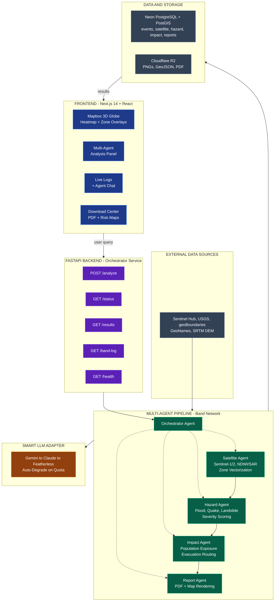

# HazardMind AI

**Autonomous multi-agent disaster intelligence for the entire planet.**

HazardMind AI detects and assesses floods, earthquakes, and landslides anywhere
on Earth by combining live satellite imagery, real geospatial analysis, and a
team of specialised AI agents that collaborate over the [Band](https://band.ai)
agent network. Point it at any city in any country and it returns a grounded,
honest risk assessment, an executive PDF report, and an interactive map — or, just
as importantly, a confident **all-clear** when there is no disaster to report.

**Live app: https://hazardmindai.online**

---

## Table of Contents

- [Why HazardMind](#why-hazardmind)
- [What Makes It Different](#what-makes-it-different)
- [System Architecture](#system-architecture)
- [The Agents](#the-agents)
- [End-to-End Pipeline](#end-to-end-pipeline)
- [Technology Stack](#technology-stack)
- [Data Sources](#data-sources)
- [Repository Layout](#repository-layout)
- [Getting Started](#getting-started)
- [Configuration](#configuration)
- [Running the Pipeline](#running-the-pipeline)
- [API Reference](#api-reference)
- [Database Schema](#database-schema)
- [Resilience & Reliability Engineering](#resilience--reliability-engineering)
- [Honesty by Design](#honesty-by-design)
- [Live Deployment](#live-deployment)
- [Deployment Notes](#deployment-notes)
- [Team](#team)
- [License](#license)

---

## Why HazardMind

When a disaster is reported, response teams need three things fast: *where* it is,
*how bad* it is, and *who* it affects. Traditional tooling either requires a GIS
analyst in the loop or produces confident-sounding output that is not grounded in
real data. HazardMind closes that gap with an autonomous pipeline that:

- works for **any location on Earth**, not a hardcoded list of demo regions
- grounds every conclusion in **real satellite imagery and real geospatial data**
- **never fabricates a disaster** — a negative finding is a first-class, correct result
- produces a publishable **executive report and interactive map** with no human in the loop

---

## What Makes It Different

| Capability | How it works |
|---|---|
| **Global coverage** | Any city resolves to its real administrative boundary (ADM3 tehsil/county-level) via geoBoundaries + a `pycountry`/Nominatim country-inference layer — covering all 249 ISO countries, not a fixed demo set. |
| **Real imagery, latest scene** | Pulls live Sentinel-2 imagery from the Copernicus Data Space, recency-weighted so the most recent usable scene wins, and mosaics multiple scenes for full coverage of the area of interest. |
| **Grounded hazard analysis** | Flood from NDWI water index; earthquake from observed USGS seismicity; landslide from a real SRTM 30 m Digital Elevation Model. Risk levels are derived deterministically from data — the model cannot inflate them from a region's reputation. |
| **Honest impact assessment** | Population impact is reasoned from real GeoNames figures; a no-significant-disaster gate reports **zero affected** instead of inventing casualties when there is no hazard. |
| **Autonomous collaboration** | Five agents coordinate over the Band network with a database-backed hand-off, so the pipeline runs end to end without a human operator. |
| **Production artifacts** | Every run produces an executive PDF, an NDWI/classification map set, and a GeoJSON of hazard zones, all uploaded to Cloudflare R2 with public-read URLs. |

---

## System Architecture



Agents communicate primarily through the **database**: each stage persists its
result, and the next stage reads it back. This makes the hand-off reliable and
auditable regardless of message-bus delivery, and gives every event a complete,
queryable trail across five tables keyed on a single event UUID.

---

## The Agents

| Agent | Role | Inputs | Outputs |
|---|---|---|---|
| **Orchestrator** | Creates the per-event room, dispatches the satellite team, monitors progress, advances each stage on real completion, and posts the final verdict. | Disaster request (location, type, magnitude) | Pipeline coordination, status, verdict |
| **Satellite** | Resolves the area to a real administrative boundary, selects and downloads the latest Sentinel-2 scene(s), computes NDWI, classifies water/wet-soil, and uploads imagery products. | location, disaster type | bbox, affected area, NDWI stats, true-color / index / classification PNGs, zones GeoJSON |
| **Hazard** | Converts raw imagery measurements into multi-hazard risk levels: flood (NDWI), earthquake (USGS), landslide (real DEM slope). | satellite result | flood/earthquake/landslide risk, overall severity, confidence |
| **Impact** | Assesses population and infrastructure exposure using real GeoNames data, with a gate that reports zero impact honestly when risk is low. | hazard result | total affected, vulnerable population, hospitals/roads at risk, vulnerability score |
| **Report** | Generates an executive PDF, a static cartographic map, and a Band-ready summary; uploads to R2. | impact result | report PDF, map PNG, completion summary |

Each agent is an independent Python service that connects to the Band network,
listens for its hand-off, and runs its own deterministic analysis tool.

---

## End-to-End Pipeline

A single request flows through the system as follows:

1. **Dispatch** — `POST /analyze` with `{ location, disaster_type, magnitude }`.
   The backend generates one event UUID, creates a dynamic per-event Band room,
   adds all five agents, writes the `disaster_events` row, and mentions the
   satellite agent.
2. **Satellite** — resolves the location to its real ADM3 admin polygon, picks
   the latest low-cloud Sentinel-2 scene (mosaicking additional scenes for full
   AOI coverage), computes NDWI, classifies the surface, uploads imagery products
   to R2, and persists `satellite_results`.
3. **Hazard** — reads the satellite result, computes flood risk from NDWI,
   earthquake risk from observed USGS seismicity, and landslide risk from a real
   SRTM 30 m slope, then writes three `hazard_zones` rows and hands off.
4. **Impact** — reads the hazard result; if no significant hazard is present it
   records an honest zero-impact assessment, otherwise it estimates exposed
   population and infrastructure from GeoNames data, and writes `impact_data`.
5. **Report** — reads the impact result, generates an executive PDF and map,
   uploads them to R2, and writes `final_reports`.
6. **Verdict** — the orchestrator posts a verdict-aware closing message
   (all-clear for a non-disaster, or a dispatch-ready summary otherwise).

The result: **five consistent database rows keyed on one event UUID**, plus a
public PDF, map, and GeoJSON on object storage.

---

## Technology Stack

**Backend & Agents**
- Python 3.12, FastAPI, asyncio
- Band SDK with a LangGraph adapter for agent collaboration
- asyncpg for PostgreSQL/PostGIS access
- shapely, numpy, rasterio/pyogrio-class raster tooling for geospatial analysis
- ReportLab for PDF generation, Pillow for map rasters

**Frontend**
- Next.js 14, React 18, TypeScript
- Mapbox GL JS — full-screen interactive 3D globe (satellite imagery, atmosphere,
  idle rotation, cinematic fly-to on query), severity-weighted risk heatmap, and
  georeferenced PNG/zone overlays
- Tailwind CSS with a custom command-center design system
- Server-side `/api/r2` proxy that serves the public Cloudflare R2 artifacts with
  CORS headers, and a backend adapter that maps the pipeline's per-agent DB rows
  onto the frontend result model

**Infrastructure**
- Neon (serverless PostgreSQL + PostGIS) for the event datastore
- Cloudflare R2 (S3-compatible) for public artifacts

**AI / LLM routing**
- Featherless AI (gemma / Kimi / Qwen / DeepSeek) as a high-capacity provider
- Google Gemini (3.1) as a primary/fallback model with multi-key rotation
- AIML (Claude / GPT) as an escalation tier

The LLM layer is used for reasoning, narrative, and natural agent-to-agent
messaging. All **risk levels** are derived from data, not from the model.

---

## Data Sources

| Source | Used for |
|---|---|
| **Copernicus Data Space (Sentinel-2)** | Live optical satellite imagery |
| **geoBoundaries** | Real administrative boundaries (ADM1–ADM3) worldwide |
| **OpenStreetMap / Nominatim** | Geocoding and country inference for any place |
| **OpenTopoData (SRTM 30 m)** | Digital Elevation Model for real slope/landslide analysis |
| **USGS Earthquake Catalog** | Observed seismicity for earthquake risk |
| **GDACS** | Global disaster alert cross-reference |
| **GeoNames** | Real population figures for impact assessment |

---

## Repository Layout

```
hazardmind-ai/
├── backend/                 # FastAPI orchestrator + REST API
│   ├── main.py              #   app + /health
│   ├── router.py            #   /analyze, /status, /results, /band-log
│   ├── orchestrator.py      #   pipeline coordination, stage advance, verdict
│   ├── band_client.py       #   Band messaging helpers
│   ├── db.py / models.py    #   Neon access + response schemas
│
├── agents/
│   ├── satellite/           # imagery: boundary, scene selection, NDWI, R2
│   │   ├── agent.py  boundary.py  geoboundaries.py
│   │   ├── sentinel.py  processor.py  intelligence.py  r2_upload.py
│   ├── hazard/              # multi-hazard risk analysis
│   │   ├── agent.py  analyzer.py  intelligence.py
│   ├── impact/              # population + infrastructure exposure
│   │   ├── agent.py  tasks/  services/
│   ├── report/              # PDF + map generation, R2 upload
│   │   ├── band_agent.py  pipeline.py  pdf_generator.py
│   │   ├── map_generator.py  intelligence.py  llm_clients.py
│
├── frontend/                # Next.js + MapLibre interactive map
├── shared/                  # shared utilities
└── README.md
```

Each agent ships its own `requirements.txt` and `.env.example`.

---

## Getting Started

### Prerequisites

- Python 3.12+
- Node.js 18+ (for the frontend)
- A Neon (or any PostgreSQL + PostGIS) database
- A Cloudflare R2 bucket
- API credentials for the data/LLM providers listed in [Configuration](#configuration)

### 1. Clone

```bash
git clone https://github.com/kodeezabdullah/hazardmind-ai.git
cd hazardmind-ai
```

### 2. Install each component

Every agent and the backend run as independent services with their own virtual
environment:

```bash
# Backend
cd backend
python -m venv venv && source venv/Scripts/activate   # Windows: venv\Scripts\activate
pip install -r requirements.txt
cd ..

# Repeat for each agent
for a in satellite hazard impact report; do
  cd agents/$a
  python -m venv venv && source venv/Scripts/activate
  pip install -r requirements.txt
  cd ../..
done
```

### 3. Frontend

```bash
cd frontend
npm install
cd ..
```

---

## Configuration

Copy the example env file and fill in your credentials:

```bash
cp .env.example .env
```

Key variables (each agent reads from its own `.env`):

```ini
# Band agent network
BAND_API_KEY=...
BAND_AGENT_ID=...
ORCHESTRATOR_AGENT_ID=...
HAZARD_AGENT_ID=...
IMPACT_AGENT_ID=...
REPORT_AGENT_ID=...

# Satellite imagery (Copernicus Data Space)
COPERNICUS_USERNAME=...
COPERNICUS_PASSWORD=...

# Database (Neon PostGIS)
NEON_DATABASE_URL=postgresql://...

# Object storage (Cloudflare R2)
CLOUDFLARE_R2_KEY=...
CLOUDFLARE_R2_SECRET=...
CLOUDFLARE_R2_BUCKET=...
CLOUDFLARE_R2_PUBLIC_URL=https://...

# LLM providers
FEATHERLESS_API_KEY=...
GEMINI_API_KEY=...
GEMINI_API_KEY_2=...   # additional keys rotate to raise effective quota
GEONAMES_USERNAME=...
```

> Secrets live only in `.env` files, which are git-ignored. Never commit them.

---

## Running the Pipeline

Start each agent listener, then the backend, then send a request.

```bash
# Start the four agent listeners (each in its own venv)
agents/satellite/venv/Scripts/python -u agents/satellite/agent.py
agents/hazard/venv/Scripts/python    -u agents/hazard/agent.py
agents/impact/venv/Scripts/python    -u agents/impact/agent.py
agents/report/venv/Scripts/python    -u agents/report/band_agent.py

# Start the backend API
cd backend
venv/Scripts/python -m uvicorn main:app --host 127.0.0.1 --port 8000
```

Trigger an analysis:

```bash
curl -X POST http://127.0.0.1:8000/analyze \
  -H "Content-Type: application/json" \
  -d '{"location":"Rawalpindi","disaster_type":"flood","magnitude":0}'
```

Poll the result:

```bash
curl http://127.0.0.1:8000/status/<job_id>
curl http://127.0.0.1:8000/results/<job_id>
```

---

## API Reference

| Method | Endpoint | Description |
|---|---|---|
| `POST` | `/analyze` | Start a pipeline run. Body: `{ location, disaster_type, magnitude }`. Returns the event `job_id`, status, and Band room id. |
| `GET` | `/status/{job_id}` | Current stage and progress of a run. |
| `GET` | `/results/{job_id}` | Full joined result (satellite + hazard + impact + report) once complete. |
| `GET` | `/band-log/{job_id}` | The agent conversation transcript for the run. |
| `GET` | `/health` | Service, Band, and database health. |

---

## Database Schema

One row set per event, keyed on the event UUID:

| Table | Holds |
|---|---|
| `disaster_events` | The original request, status, and Band room id |
| `satellite_results` | Imagery products, bbox/bounds, affected area, artifact URLs |
| `hazard_zones` | One row per hazard type (flood / earthquake / landslide) with risk level + severity |
| `impact_data` | Population affected, vulnerable population, infrastructure at risk, vulnerability score |
| `final_reports` | Report status, PDF URL, map URL, summary |

---

## Resilience & Reliability Engineering

HazardMind is built to keep running through real-world failures:

- **Database hand-off** — agents persist results and read the next stage's input
  from the database, so the pipeline is reliable even when the message bus
  returns an empty room history.
- **Deterministic dispatch** — each agent drives its own analysis tool directly
  instead of depending on a model to emit a tool call, so a weak adapter model
  cannot stall a stage.
- **Multi-provider LLM routing** — Gemini-primary with multi-key rotation and a
  Featherless fallback keeps the narrative/reasoning layer responsive under
  provider congestion or quota limits.
- **Graceful reconnects** — agents retry the agent-network websocket with backoff
  when the platform rate-limits rapid reconnections.
- **Idempotent writes** — re-running an event refreshes its rows instead of
  duplicating them.
- **Stage gating** — the orchestrator only advances on a genuine completion
  (real room signal or a persisted database row), never on its own echo.

---

## Honesty by Design

For a neutral verification (for example, *"is there flooding in this city?"*),
**"no disaster detected" is a valid and correct answer**, and the system is
engineered to report it honestly:

- Hazard risk levels are derived deterministically from observed data (NDWI,
  USGS magnitude, real DEM slope) — a model cannot inflate them from a region's
  general reputation.
- The impact agent has a no-significant-disaster gate that reports **zero
  affected** for a low-risk event instead of fabricating casualties.
- The orchestrator's closing verdict is outcome-aware: an all-clear for a
  non-disaster, or a dispatch-ready brief otherwise.

A run over a calm city returns flood / earthquake / landslide all **LOW**,
**0 people affected**, and an all-clear executive report — grounded in the
latest real imagery.

---

## Live Deployment

**Live app:** https://hazardmindai.online

The full system runs in the cloud. The five services are deployed as independent
Docker Spaces on Hugging Face and collaborate through the Band network; the
frontend is served from Vercel.

| Service | Hugging Face Space |
|---|---|
| Orchestrator (backend) | https://huggingface.co/spaces/kodeezabdullah/hazardmind-backend |
| Satellite agent | https://huggingface.co/spaces/gridforce/satellite |
| Hazard agent | https://huggingface.co/spaces/kodeezabdullah/hazard |
| Impact agent | https://huggingface.co/spaces/kodeezabdullah/impact |
| Report agent | https://huggingface.co/spaces/gridforce/report |

---

## Deployment Notes

- Each agent and the backend are independent services and can be deployed as
  separate containers/processes.
- The satellite agent performs heavy raster I/O (large band downloads, mosaic,
  NDWI) and benefits from generous memory and ephemeral disk; intermediate files
  are cleaned up after each run, and only final products are persisted to R2.
- Public artifacts (PDF, map, GeoJSON, PNGs) are served from Cloudflare R2 with
  public-read URLs.
- The datastore is Neon (serverless PostgreSQL + PostGIS); the schema is the five
  tables described above.

---

## Team

Built by **Team GridForce**.

HazardMind AI is the work of Team GridForce — engineering an autonomous,
planet-scale disaster-intelligence platform that turns live satellite imagery and
real geospatial data into grounded, honest risk assessments.

---

## License

Released under the [MIT License](LICENSE).

---

**HazardMind AI** — grounded, autonomous, planet-scale disaster intelligence.
Built by **Team GridForce**.
