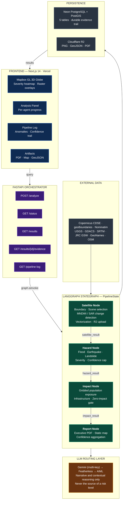

<div align="center">

# HazardMind AI

**Uncertainty-aware multi-agent satellite hazard detection.**

Detect and assess floods, earthquakes and landslides anywhere on Earth from live
Sentinel imagery — with a system engineered to state what it does not know.

[**Live application →**](https://hazardmindai.online)

</div>

---

HazardMind AI is an autonomous geospatial analysis platform. Given a place name
and a hazard type, five specialised agents resolve the real administrative
boundary, acquire and process live Sentinel-1 and Sentinel-2 imagery, derive
hazard extent from physically grounded remote sensing methods, quantify
population and infrastructure exposure, and produce an executive report — with
an uncertainty estimate that propagates across every stage.

It is designed around a single principle: **a system that reports its own
limitations is more useful than one that always returns an answer.** When the
imagery cannot support a conclusion, HazardMind says so.

---

## Table of Contents

- [Validated Performance](#validated-performance)
- [What Makes It Different](#what-makes-it-different)
- [System Architecture](#system-architecture)
- [The Agent Pipeline](#the-agent-pipeline)
- [Detection Methods](#detection-methods)
  - [Sentinel-2 Optical Flood Mapping](#sentinel-2-optical-flood-mapping)
  - [Sentinel-1 SAR Flood Mapping](#sentinel-1-sar-flood-mapping)
  - [Landslide Detection](#landslide-detection)
  - [Earthquake Damage Detection](#earthquake-damage-detection)
- [Scene Selection and Coverage](#scene-selection-and-coverage)
- [Uncertainty Propagation](#uncertainty-propagation)
- [Validation Methodology](#validation-methodology)
- [Known Limitations](#known-limitations)
- [Target Architecture](#target-architecture)
- [Technology Stack](#technology-stack)
- [Data Sources](#data-sources)
- [Repository Layout](#repository-layout)
- [Getting Started](#getting-started)
- [Configuration](#configuration)
- [Running the Pipeline](#running-the-pipeline)
- [API Reference](#api-reference)
- [Database Schema](#database-schema)
- [Reliability Engineering](#reliability-engineering)
- [Team](#team)
- [License](#license)

---

## Validated Performance

All figures below are measured against Copernicus Emergency Management Service
(EMS) Rapid Mapping reference delineations, using a validation harness that runs
the production pipeline through its real entry point with no mocking of the
analysis path.

### Sentinel-2 optical flood mapping

| Metric | Value |
|---|---|
| IoU | **0.9624** |
| Precision | **0.9863** |
| Recall | **0.9754** |
| F1 | **0.9808** |

*Kanalia, Greece (EMSR692). Permanent-water-excluded frame.*

### Sentinel-1 SAR flood mapping

| Event | Post-peak latency | IoU | Precision | Recall | F1 |
|---|---|---|---|---|---|
| Tychero (EMSR277) | — | 0.4641 | **0.8784** | 0.4960 | **0.6340** |
| Keramidi (EMSR271) | 4 days | 0.1684 | 0.5858 | 0.1911 | 0.2882 |
| Kanalia (EMSR692) | 8 days | 0.0083 | 0.0567 | 0.0096 | 0.0165 |
| Žalgiriai (EMSR267) | — | *no recoverable signal — detectability guard fired correctly* | | | |

Precision rises from 0.06 to 0.88 across independent events as acquisition
latency falls. **Acquisition timing is the binding operational constraint on
SAR rapid flood mapping**, not threshold tuning.

### The bidirectional finding

An isolating experiment on Keramidi — identical AOI, identical reference,
identical scenes, with only the detection direction varying:

| Detection direction | IoU | Precision | F1 |
|---|---|---|---|
| Decrease only (conventional) | 0.0032 | 0.1821 | 0.0064 |
| **Bidirectional** | **0.1684** | **0.5858** | **0.2882** |

**F1 improves 45×.** The mechanism is measured, not inferred: `rise_px = 43,048`
against `drop_px = 2,500`. **94% of the recoverable flood signal is a backscatter
*increase*** — the double-bounce return from water among emergent vegetation,
which a conventional decrease-only detector cannot see.

The two thresholds are not mirror images (drop −4.200 dB, rise +2.816 dB), so
taking the absolute value of a single criterion would apply the drop-derived cut
to the majority of the signal. The modes are pooled and thresholded separately
by sign.

### Radiometric calibration is not required

For same-relative-orbit acquisitions, the radiometric calibration factor cancels
in the log-ratio. This was verified empirically rather than assumed: three
same-orbit acquisitions spanning 24 days have `sigmaNought` calibration LUTs
agreeing to **0.003%** — a residual of 0.00024 dB against a 3 dB flood
criterion, five orders of magnitude below the signal.

A unit test asserts the operational consequence directly: applying an arbitrary
calibration factor of *k* = 7.3 to every scene produces a **bit-identical** flood
mask.

Calibration remains necessary for absolute σ⁰ reporting or cross-orbit
comparison. It is not necessary for the flood answer.

---

## What Makes It Different

| Capability | Implementation |
|---|---|
| **Global coverage** | Any place resolves to its real administrative boundary (ADM1–ADM3) via geoBoundaries with a `pycountry`/Nominatim country-inference layer — all 249 ISO countries, not a hardcoded demo set. Boundary resolution is pinned and replayed deterministically. |
| **Bidirectional SAR detection** | Detects both the specular decrease over open water and the double-bounce increase over flooded vegetation, with each mode thresholded independently. Conventional decrease-only detection misses 94% of the signal in vegetated floodplains. |
| **Physically grounded methods** | MNDWI for optical water, Kittler–Illingworth adaptive thresholding, HAND and layover/shadow masking for SAR, DEM-derived landslide susceptibility, polarimetric change for structural damage. Risk levels are derived from data, never inferred by a model from a region's reputation. |
| **Permanent water as context, not noise** | JRC Global Surface Water occurrence is rendered as its own overlay class rather than subtracted. The river remains visible on the map; it is simply never classified as a risk zone, and downstream agents are told its name and area. |
| **Refusal to assert** | The pipeline returns `insufficient_coverage`, `insufficient_reference` or `indeterminate` rather than a confident map it cannot support. A signal-detectability guard prevents shipping a worse-than-chance extent. |
| **Uncertainty propagation** | Data-quality uncertainty at the imagery stage constrains downstream confidence. A satellite stage reporting 0.0 confidence cannot produce a HIGH-confidence report, and this is enforced by an explicit invariant and a regression test. |
| **Durable evidence trail** | Every deterministic verdict is re-derivable from the database alone — DEM grid samples with the gradient computation, USGS events with per-event magnitude type, coverage geometry, index calibration status. No re-run required to audit a past decision. |

---

## System Architecture


```mermaid
flowchart TB
    subgraph CLIENT["FRONTEND — Next.js 14 · Vercel"]
        direction LR
        Globe["Mapbox GL 3D Globe<br/>Severity heatmap · Raster overlays"]
        Panel["Analysis Panel<br/>Per-agent progress"]
        Logs["Pipeline Log<br/>Anomalies · Confidence trail"]
        DL["Artifacts<br/>PDF · Map · GeoJSON"]
    end

    subgraph API["FASTAPI ORCHESTRATOR"]
        direction LR
        E1["POST /analyze"]
        E2["GET /status"]
        E3["GET /results"]
        E4["GET /results/{id}/evidence"]
        E5["GET /pipeline-log"]
    end

    subgraph GRAPH["LANGGRAPH STATEGRAPH — PipelineState"]
        direction TB
        SAT["<b>Satellite Node</b><br/>Boundary · Scene selection<br/>MNDWI / SAR change detection<br/>Vectorization · R2 upload"]
        HAZ["<b>Hazard Node</b><br/>Flood · Earthquake · Landslide<br/>Severity · Confidence cap"]
        IMP["<b>Impact Node</b><br/>Gridded population exposure<br/>Infrastructure · Zero-impact gate"]
        REP["<b>Report Node</b><br/>Executive PDF · Static map<br/>Confidence aggregation"]
        SAT -->|satellite_result| HAZ
        HAZ -->|hazard_result| IMP
        IMP -->|impact_result| REP
    end

    subgraph LLM["LLM ROUTING LAYER"]
        FALL["Gemini (multi-key) → Featherless → AIML<br/>Narrative and contextual reasoning only<br/>Never the source of a risk level"]
    end

    subgraph DATA["PERSISTENCE"]
        DB["Neon PostgreSQL + PostGIS<br/>5 tables · durable evidence trail"]
        R2["Cloudflare R2<br/>PNG · GeoJSON · PDF"]
    end

    subgraph EXT["EXTERNAL DATA"]
        SRC["Copernicus CDSE · geoBoundaries · Nominatim<br/>USGS · GDACS · SRTM · JRC GSW · GeoNames · OSM"]
    end

    CLIENT -->|query| API
    API -->|graph.ainvoke| GRAPH
    GRAPH --> LLM
    GRAPH --> DATA
    SRC --> GRAPH
    DATA -->|results| CLIENT

    classDef client fill:#0f2b52,stroke:#3b82f6,color:#fff
    classDef api fill:#3b1d78,stroke:#8b5cf6,color:#fff
    classDef agent fill:#0a4a3a,stroke:#10b981,color:#fff
    classDef llm fill:#6b3410,stroke:#f59e0b,color:#fff
    classDef data fill:#2a3441,stroke:#64748b,color:#fff
    class Globe,Panel,Logs,DL client
    class E1,E2,E3,E4,E5 api
    class SAT,HAZ,IMP,REP agent
    class FALL llm
    class DB,R2,SRC data
```

### Orchestration model

The pipeline is a **LangGraph `StateGraph`** with a typed `PipelineState`
carrying data between nodes. Conditional edges route directly to `END` the
moment any node reports `status: "failed"`, so a degraded stage cannot silently
propagate into a confident report.

Each agent remains an independently deployable service with its own dependency
set — the satellite agent alone requires GDAL-adjacent geospatial libraries that
the rest of the system does not. `backend/graph.py` loads each agent's `node.py`
through an isolated `importlib` loader with per-agent module namespacing, so the
agents keep self-contained internal imports without name collisions.

`PipelineState` is the in-process hand-off; the database is the durable record.
Both are written, and the report stage reads from the database so that any past
event remains fully reconstructable.

---

## The Agent Pipeline

### Orchestrator

The **Orchestrator** is the pipeline's control plane. It is not a graph node —
it is the layer that drives the graph.

On dispatch it generates the event UUID exactly once (a single-assignment
discipline adopted after UUID mutation across stage boundaries proved a
recurring defect class), writes the `disaster_events` record, constructs the
initial `PipelineState` from the request parameters and caller-supplied budgets,
and invokes the compiled `StateGraph`.

Through execution it gates concurrency, advances persisted stage and progress
state, and on completion writes the accumulated error, anomaly and confidence
trail to the event's pipeline log. Where a node reports failure, the graph's
conditional edges route directly to termination and the orchestrator records the
terminal state rather than allowing a degraded result to continue downstream.

It owns the event lifecycle. The four analysis agents below own the analysis.

### Analysis agents

| Agent | Responsibility | Key outputs |
|---|---|---|
| **Satellite** | Resolves the location to a real administrative polygon. Selects and acquires Sentinel-1/2 scenes under coverage and cost constraints. Computes the hazard index, classifies, vectorizes, and uploads artifacts. Self-assesses evidence quality. | `bbox`, `flood_area_km2`, `permanent_water_area_km2`, index type and calibration status, coverage and gap geometry, artifact URLs, `confidence` with `confidence_basis` |
| **Hazard** | Converts imagery measurements into risk levels for flood, earthquake and landslide. Fetches independent third-party context and records the raw evidence behind each deterministic verdict. | `flood_risk`, `earthquake_risk`, `landslide_risk`, `primary_hazard_risk`, `overall_severity`, per-hazard confidence, `evidence_basis` |
| **Impact** | Quantifies population and infrastructure exposure by intersecting a gridded population raster with the actual hazard extent. Reports zero honestly when the hazard does not warrant an assessment. | `total_affected`, `high_risk_people`, hospitals / schools / roads at risk, `vulnerability_score`, `overall_confidence` |
| **Report** | Synthesises an executive narrative across seven intelligence sections, renders a cartographic map and PDF, and aggregates confidence conservatively. | Executive PDF, static risk map, `executive_summary`, `confidence_level` |

The satellite agent is the only stage that performs raster I/O. It is
memory-intensive by nature — a two-scene Sentinel-1 mosaic at full resolution
peaks near 9.6 GB RSS before windowed clipping — and is sized accordingly in
deployment.

---

## Detection Methods

### Sentinel-2 Optical Flood Mapping

**Index.** MNDWI — the Modified Normalized Difference Water Index (Xu, 2006):

```
MNDWI = (B03 − B11) / (B03 + B11)
```

MNDWI uses the SWIR band rather than NIR precisely because built-up surfaces
register as water under the conventional NDWI formulation. B11 is resampled from
20 m to the 10 m grid of B03.

**Cloud and shadow masking.** The Scene Classification Layer is applied
per-pixel before the index is computed, masking saturated pixels, dark areas,
cloud shadow, medium- and high-probability cloud, and thin cirrus. Cloud shadow
is the largest false-positive source in any water index after built-up surface,
because it behaves almost identically to water spectrally.

Masked pixels are excluded from the index, the classification, the mean and the
area — never silently treated as zero.

**Thresholding.** Kittler–Illingworth minimum-error thresholding, derived
per-scene from the index histogram within the AOI. KI is used rather than Otsu
because Otsu assumes two Gaussian populations, which reflectance distributions
over water and land are not.

KI assumes a bimodal histogram. When the flooded fraction is small the histogram
is effectively unimodal, and an unguarded KI will slice the land distribution in
half and manufacture phantom water. Two guards apply:

1. **Bimodality test** before KI is attempted; the fixed threshold is used as a
   fallback when the test fails, and the fallback is recorded.
2. **Upper-mode plausibility** — the upper mode must be plausibly water. This
   guard was introduced after a measured regression in which KI found a
   genuinely bimodal histogram whose *both* modes were dry land.

The derived threshold is recorded in the result, so any run's classification is
re-derivable.

**Permanent water.** JRC Global Surface Water occurrence is used to distinguish
flood from normal hydrology. Permanent water is rendered as its own class rather
than subtracted — the river stays on the map — and reported separately:

```
permanent_water_area_km2    normal hydrology, never a risk zone
flood_area_km2              water beyond the permanent baseline
total_water_area_km2        the conflated figure, for reference
```

Named features are resolved via Overpass and carried downstream, so the hazard
agent is told *"the AOI contains the Chenab, a permanent water body covering
X km²; water beyond that baseline is Y km²"* rather than receiving a bare
percentage it cannot interpret.

**Built-up context.** IBI (Xu, 2008) rather than NDBI, because NDBI
misclassifies bare soil as built-up — a material problem in semi-arid terrain:

```
IBI = (NDBI − (SAVI + MNDWI)/2) / (NDBI + (SAVI + MNDWI)/2)
```

Built-up serves two purposes: identifying where the water index deserves less
confidence, and providing the exposure base for impact assessment.

---

### Sentinel-1 SAR Flood Mapping

SAR is the path that matters when it matters most — flooding and cloud arrive
together, and optical sensors are blind precisely when the event is unfolding.

**Bidirectional change detection.** The core method, and the project's principal
empirical finding.

```
ρ = 10·log₁₀(σ_post / σ_baseline)
```

Water behaves in two opposite ways depending on what it covers:

- **Open water** is specular. The signal reflects away from the sensor and
  backscatter *falls*.
- **Flooded vegetation** produces double-bounce scattering between the water
  surface and plant stems — a corner reflector. Backscatter *rises*.

Conventional SAR flood mapping searches only for the decrease. In vegetated
floodplains this misses the majority of the signal. Measured on Keramidi:
43,048 rise pixels against 2,500 drop pixels — 94% of the recoverable signal is
an increase.

The two populations are pooled and thresholded **separately by sign**, because
the derived cuts are not mirror images (−4.200 dB and +2.816 dB on that event).

**Why the log-ratio.** SAR speckle is multiplicative, not additive. A difference
operator is statistically invalid; the log-ratio transforms speckle into an
additive term, which is what makes subsequent thresholding defensible.

**Baseline.** A three-scene same-relative-orbit median over a 30-day window
preceding the event. The same-orbit constraint is not a preference — it is the
basis of the method's validity, since the calibration factor and
terrain-induced backscatter variation are common to both acquisitions and cancel
in the ratio. A longer stack is deliberately avoided: a full-year baseline spans
the crop cycle, so its standard deviation is dominated by seasonal variation
rather than flood-relevant variation, which makes the detector less sensitive
rather than more.

Where no same-orbit pre-event scene exists, the pipeline returns
`insufficient_reference` rather than falling back to absolute thresholding.

**Processing chain.**

| Stage | Method |
|---|---|
| Georeferencing | Explicit-GCP reproject via `WarpedVRT` into the AOI's UTM zone, with a guard rejecting all-zero warps |
| Speckle filtering | Refined Lee, 7×7 |
| Change operator | Log-ratio, bidirectional |
| Terrain masking | HAND — water cannot stand above a threshold height relative to the nearest drainage channel |
| Geometry masking | Layover and radar shadow computed from DEM and orbit geometry |
| Thresholding | Hierarchical tile-based Kittler–Illingworth |
| Post-processing | Morphological opening, minimum-area filter |

HAND masking is the single largest false-positive control for SAR. Radar shadow
in relief terrain produces near-zero return that is spectrally indistinguishable
from water; HAND asserts that water cannot physically be there.

**Signal detectability.** Before shipping an extent, the pipeline tests whether
the change image carries a recoverable signal at all. A scene acquired well after
the flood peak may contain no separable population in either direction — on
Kanalia at eight days post-peak, flood and dry pixels inside the confirmed
reference were statistically indistinguishable (ROC AUC 0.487, below chance).

In that case the extent is reported as **indeterminate** rather than shipped as a
map. Two earlier versions of this guard were built, measured and discarded: one
was circular (it partitioned the data by the very threshold it was checking) and
one ranked a no-signal scene as *more* bimodal than a real flood.

**Bandwidth.** Sentinel-1 acquisition fetches the VV band only via the per-band
Nodes path — 676 MB per scene rather than a 1.1–1.7 GB full archive.

---

### Landslide Detection

**Detection — bi-temporal NDVI with shape filtering.**

A single-scene absolute NDVI threshold cannot separate a landslide scar from
terrain that was always bare. Detection therefore operates on the difference
between a pre-event and post-event acquisition.

An NDVI drop alone is still insufficient — harvesting produces one too.
Landslide scars have characteristic geometry, so each connected component is
filtered on:

- elongation ratio
- orientation alignment with slope aspect
- minimum underlying slope
- minimum area
- downslope tapering

A circular NDVI drop on flat ground is not a landslide. Shape is what separates
the two.

**Susceptibility — computed, not imported.** Derived entirely from the DEM the
pipeline already acquires:

| Factor | Rationale |
|---|---|
| Slope, 90th percentile | Landslides are local; a district mean averages away the one steep valley |
| Plan curvature | Lateral flow convergence |
| Profile curvature | Flow acceleration |
| TWI = ln(a / tan β) | Topographic wetness |
| SPI = a · tan β | Stream power, erosion potential |
| Aspect | Moisture retention, insolation |
| Distance to drainage | Undercutting |

An externally modelled susceptibility product is deliberately not consumed.
Susceptibility is computed from primary terrain data because the judgment is the
system's own contribution.

**Trigger.** Susceptibility describes where a landslide is possible; antecedent
rainfall describes whether one is occurring. Without a trigger term, a static
slope model returns the same answer in monsoon and in drought.

---

### Earthquake Damage Detection

Ground shaking is not observable from satellite — it is measured by seismometer
networks. The USGS event catalogue is therefore used strictly as a **trigger**:
an earthquake occurred, here, at this magnitude. Modelled shaking-intensity and
loss products are not consumed, because consuming them would replace the
system's own analysis with another system's conclusion.

What *is* observable is structural damage, and it is detectable through a change
in scattering mechanism:

```
standing structure   →  double-bounce (wall–ground corner reflector), VV dominant
collapsed structure  →  volume scattering (randomised rubble), VH rises relative to VV
```

The change in the **VH/VV ratio** is therefore a damage indicator, and a more
specific one than intensity change alone, because it reflects a change in
*mechanism* rather than merely in brightness.

The detector operates on same-relative-orbit pre/post pairs and is constrained
by the IBI built-up layer — damage is assessed only where structures exist.

**Resolution limit.** Sentinel-1 at 10 m cannot resolve individual buildings.
This method detects large-scale destruction, not per-structure damage, and the
result states so. InSAR coherence change is the stronger approach but requires
SLC products and an interferometric processing chain.

---

## Scene Selection and Coverage

Scene selection is a constrained search, not a best-effort fetch.

**Coverage banding.** Coverage is measured on *valid pixels after nodata and
cloud masking*, over an interior AOI eroded by one pixel width so that
rasterization artifacts along the boundary do not register as gaps.

| Coverage | Outcome |
|---|---|
| ≥ 90% (target) | Complete; confidence reduced proportionally to the shortfall |
| 80–90% | Complete, flagged `below_target_coverage`, larger confidence penalty, anomaly recorded |
| < 80% (floor) | `insufficient_coverage` with gap geometry — a hard stop |

The target is caller-settable but clamped server-side into [80, 100]. Every run
reports actual coverage, gap count, gap area and gap attribution regardless of
which band it lands in.

Gap attribution distinguishes **nodata-caused** from **cloud-caused** gaps,
because they have entirely different remedies: another scene may close a nodata
gap; no number of scenes will close a cloud gap.

**Temporal coherence tiers.** Scenes are selected to minimise temporal spread
subject to the coverage constraint, escalating through same-date/same-orbit,
then widening windows, then relaxed orbit. Tier escalation lowers confidence and
records the temporal spread. For Sentinel-1 the same-orbit windows are derived
from the measured ~11-day revisit over the target geography rather than chosen as
round numbers.

**Search budgets.** Enforced across the whole search, not per tier: maximum
scenes, maximum download volume, maximum wall-clock. Any budget exhausted halts
the search immediately and returns the best coverage achieved, naming the budget
that bound.

An earlier absolute 100%-coverage requirement was removed after it converted
ordinary cloud cover into an unbounded search — a 2.4 × 2.7 km town consumed
four scenes and six hours chasing a gap that no additional imagery could close.
The defect it was written to prevent, silent acceptance of partial coverage, is
now addressed by explicit reporting rather than refusal.

**Satellite selection.** Optical is preferred when the sky permits. Cloud cover
is measured over the AOI itself via an SCL peek rather than taken from
scene-level metadata, because a tile can be 45% cloudy overall and clear over a
small municipality — and a misjudgement here routes the run onto the SAR path
unnecessarily.

---

## Uncertainty Propagation

Every stage computes a confidence estimate, and upstream uncertainty constrains
downstream conclusions.

**Evidence and concerns.** The satellite agent's `ConfidenceTracker` accumulates
weighted evidence from independent cross-checks — GDACS event correspondence,
USGS seismicity, cloud fraction, index physics, coverage — and subtracts
penalties for recorded concerns.

**Basis, not just a number.** A low confidence score is ambiguous on its own: it
may mean *no evidence was gathered* or *the evidence contradicts the result*.
These are materially different states, and the tracker reports which:

```
insufficient_evidence · evidence_weak · evidence_supports · evidence_contradicts
```

**Propagation.** Satellite confidence caps flood confidence in the hazard agent,
since flood is the only hazard derived from satellite output — earthquake and
landslide self-source from USGS and DEM and are correctly independent.

Report-level aggregation is **minimum-dominant** rather than averaged. A flat
average allows one confident stage to mask a near-zero one; the minimum enforces
the invariant that a report cannot be more confident than its least-confident
input. An explicit assertion and a regression test guard this, so a future
refactor cannot silently remove it.

**A measured correction.** The index-physics check originally compared the
*whole-AOI* mean index against a water threshold. Because that mean remains
negative until roughly 43% of the AOI is water — a catastrophic fraction — the
check fired on essentially every realistic flood, including one that scored
F1 0.98. The comparison now uses the mean over classified water pixels and
accounts for the flooded fraction. Before this correction the confidence field
carried no information; after it, the ordering across events is correct.

---

## Validation Methodology

Validation is performed by a harness that runs the **production pipeline through
its real entry point**, with results read from the durable evidence trail rather
than from logs or in-memory returns.

**Reference data.** Copernicus EMS Rapid Mapping delineation products, selected
against explicit qualification criteria: Sentinel post-event provenance verified
from the product's own source metadata (not the activation description), a
reachable same-orbit pre-event baseline, and L2A-era acquisition dates.

**AOI pinning.** Boundary resolution is disk-cached and replayed bit-identically
across runs. This was introduced after a geocoding service resolved the same
place name as a zero-area point on one day and a linestring on the next, moving
the derived buffer and with it both the prediction and the clipped reference —
rendering an entire measurement series incomparable and producing a headline
metric that described geometry drift rather than detector behaviour.

**Metric frames.** Because EMS references include permanent water, excluding it
from the prediction diverges from the reference by definition. Metrics are
therefore reported in both including- and excluding-permanent-water frames, and
each figure states which frame it belongs to.

**One change at a time.** Each modification is measured in isolation against the
full event set and kept only if the numbers support it. Changes that degraded
performance were discarded on measurement — including one that appeared to
improve IoU 2.5× while delivering a precision lift of 0.78×, worse than labelling
the entire AOI as flooded.

---

## Known Limitations

Stated plainly, because a system that reports its limits is the point.

**Every validated flood event is rural or open-terrain.** EMS semi-automatic
extraction maps standing water in open terrain, not water within dense urban
fabric. At one urban test event the reference intersected 1.3% of the municipal
polygon in a town where flooding killed over 200 people. **Reported flood metrics
describe open-terrain detection and must not be assumed to transfer to cities**,
where population exposure concentrates.

**Earthquake damage detection is implemented but not validated.** EMS grading
products are built from sub-metre very-high-resolution imagery for per-structure
assessment — roughly two orders of magnitude finer than Sentinel-1 resolves.
Three well-timed candidate events were evaluated and rejected on granularity
grounds. This is a property of available reference data, not of the detector.

**Landslide detection is implemented but not validated.** No inventory was found
combining polygon extents large enough for a 10 m sensor with Sentinel post-event
provenance. Of the post-2018 records in the one reachable polygon service, 15 of
18 are under 0.04 km² — approximately 40 pixels.

**Confidence calibration is unvalidated.** The ordering across events is correct
and the propagation invariants are enforced and tested, but a calibration claim
requires more scored accuracy points than currently exist.

**Sentinel-1 performance depends critically on acquisition latency.** At eight
days post-peak, no threshold, filter, baseline depth or detection direction
recovers a signal that is not present in the imagery. The 12-day same-orbit
revisit is a real operational constraint on SAR rapid mapping.

**No comparative baseline.** Performance is reported against reference
delineations, not against an alternative system.

---

## Target Architecture

The system described above is what runs today. This section documents the
architecture it is being built toward. **Nothing in this section is implemented
yet**, and it is stated separately for exactly that reason.

### Distributed execution

The pipeline is long-running and memory-heavy — the satellite stage peaks near
9.6 GB on a two-scene mosaic while the report stage completes in seconds.
Synchronous execution cannot hold many concurrent multi-minute jobs, and
replicating a single process wastes the satellite stage's footprint on every
replica.

A **Celery job queue over Redis** replaces synchronous invocation. Each agent
becomes an independently scalable worker class with its own resource profile and
its own container image — restoring the deployment independence the agents
already have at the code level.

```
API layer          512 MB    autoscale on request rate
Satellite worker    16 GB    autoscale on queue depth, scale to zero
Hazard worker        2 GB
Impact worker        2 GB
Report worker        4 GB
```

Queue depth provides natural backpressure: a burst queues rather than failing,
and the current concurrency gate — which busy-waits — disappears.

### Durable graph state

A **LangGraph `PostgresSaver` checkpointer** persists state after each node.
This yields three things at once: a crashed pipeline resumes from the failed
stage rather than restarting, progress tracking becomes a property of the
checkpoint rather than separate bookkeeping, and interactive gating becomes
possible — the pipeline can pause at, say, 87% coverage and ask an operator
whether to proceed, which requires `interrupt()` and a persistent checkpoint.

### Query intelligence layer

Between the request and the pipeline sits an interpretation layer, on its own
database instance so that vector and analytical workloads do not contend with
the transactional pipeline data.

**Semantic intent classification.** Queries are embedded and matched against
known intent patterns, so casual, ambiguous or exploratory input never triggers
a full satellite acquisition. Classification is semantic rather than
keyword-based, because the same request arrives in many phrasings and in more
than one language.

**Multi-source location resolution.** geoBoundaries, Nominatim and the system's
own accumulated gazetteer are queried in parallel with confidence-weighted
merging, rather than as a sequential fallback chain. Every successful resolution
is cached, so geographic coverage improves with use and dependence on external
services decreases over time.

Where no source resolves a place, a language model proposes candidate names
which are then re-verified against the same real geocoding services. A model
never produces coordinates directly.

**Freshness-aware analysis caching.** Cached results are reused under
per-hazard decay rather than a single time window, because the hazards age
differently: flood extent changes within days, landslide susceptibility over
months, and earthquake relevance is trigger-based rather than time-based.
Cache validity is additionally invalidated by new events — significant rainfall
or a new seismic event forces re-analysis regardless of age.

The reuse decision is explained rather than silent. Where a cached result is
served, the reasoning appears in the pipeline log alongside the confidence
adjustment for its age.

This is the highest-throughput multiplier in the roadmap. Query volume
concentrates on a small number of populated areas, so cache hits convert most
requests from a multi-minute acquisition into an immediate response.

### Historical analysis

A supplied past date routes the pipeline against archival imagery rather than
the latest acquisition. Cached historical results never expire — a 2022 flood
analysis is correct permanently — which makes historical mode structurally
cheaper than real-time.

### Self-hosted inference

Intent classification, location candidate generation and cache reasoning are
short structured-output tasks that do not require a frontier model. Moving them
to **locally hosted models** removes external quota from the majority of
language-layer calls, reserving hosted providers for the quality-critical
interpretation and narrative work.

### Adaptive permanent water

The static occurrence layer is dated and cannot know about new impoundments,
drained lakes or shifted channels. A future version accumulates its own observed
water history per area of interest, progressively refining the static prior — the
same pattern as the location gazetteer and the analysis cache. The system
improves at the places it has seen.

### Operations

Kubernetes with per-agent node pools and queue-depth autoscaling; structured
logging and per-stage metrics with alerting on stalled pipelines; infrastructure
as code with a staging environment; and analytics over the query log covering
usage patterns, cache hit rate, per-agent failure rates and accuracy tracking
against reference events.

---

## Technology Stack

**Backend and agents**

- Python 3.12, FastAPI, asyncio
- LangGraph `StateGraph` for pipeline orchestration
- `asyncpg` for PostgreSQL/PostGIS
- `rasterio`, GDAL, `shapely`, `pyproj`, `numpy`, `scipy`, `scikit-image`
- ReportLab for PDF generation, Pillow for cartographic rendering
- `boto3` for S3-compatible object storage

**Frontend**

- Next.js 14, React 18, TypeScript
- Mapbox GL JS — full-screen 3D globe, severity-weighted heatmaps, georeferenced
  raster and vector overlays
- Tailwind CSS

**Infrastructure**

- Neon — serverless PostgreSQL with PostGIS
- Cloudflare R2 — S3-compatible object storage for public artifacts
- Vercel — frontend hosting
- Docker — one image per service

**LLM routing**

Google Gemini with multi-key rotation as primary, Featherless as fallback, an
AIML tier for escalation. The language layer produces narrative, contextual
interpretation and cross-validation reasoning. **It never produces a risk level
or an area figure** — those are derived deterministically from the imagery.

---

## Data Sources

| Source | Purpose |
|---|---|
| Copernicus Data Space Ecosystem | Sentinel-1 GRD and Sentinel-2 L2A imagery |
| geoBoundaries | Administrative boundaries, ADM1–ADM3, 249 countries |
| OpenStreetMap / Nominatim | Geocoding, country inference, named water features |
| Overpass API | Infrastructure and hydrographic features |
| SRTM (via OpenTopoData) | Digital elevation model for slope, HAND, curvature |
| JRC Global Surface Water | Permanent water occurrence, 1984–2021 |
| USGS Earthquake Catalog | Observed seismicity as an event trigger |
| GDACS | Independent disaster alert cross-reference |
| GeoNames | Administrative population figures |
| Copernicus EMS Rapid Mapping | Validation reference delineations |

---

## Repository Layout

```
hazardmind-ai/
├── backend/
│   ├── main.py                    FastAPI application, health
│   ├── router.py                  /analyze, /status, /results, /pipeline-log
│   ├── graph.py                   LangGraph StateGraph construction
│   ├── orchestrator.py            Event lifecycle, concurrency gating
│   ├── db.py  models.py           Persistence and response schemas
│
├── agents/
│   ├── satellite/
│   │   ├── node.py                LangGraph node interface
│   │   ├── agent.py               Pipeline orchestration
│   │   ├── boundary.py            Administrative boundary resolution
│   │   ├── geoboundaries.py       geoBoundaries client
│   │   ├── sentinel.py            CDSE catalogue, tiers, token management
│   │   ├── processor.py           Raster processing, indices, change detection
│   │   ├── confidence_tracker.py  Evidence accumulation and basis
│   │   ├── cross_validator.py     Independent cross-checks
│   │   ├── intelligence.py        Contextual interpretation
│   │   └── r2_upload.py           Artifact upload
│   │
│   ├── hazard/
│   │   ├── node.py  agent.py
│   │   ├── analyzer.py            Multi-hazard risk derivation
│   │   └── intelligence.py
│   │
│   ├── impact/
│   │   ├── node.py  agent.py
│   │   ├── tasks/                 Population, infrastructure, vulnerability
│   │   └── services/              Persistence
│   │
│   └── report/
│       ├── node.py  pipeline.py
│       ├── generator.py           Narrative synthesis
│       ├── intelligence.py        Seven-section intelligence layer
│       ├── pdf_generator.py       Executive report rendering
│       ├── map_generator.py       Cartographic rendering
│       └── db_client.py           Context assembly, confidence aggregation
│
├── shared/
│   ├── pipeline_state.py          The inter-agent contract
│   ├── db/migrations/             Numbered, idempotent schema migrations
│   └── utils/llm_fallback.py      Provider routing
│
├── tests/
│   ├── e2e/                       End-to-end pipeline harness
│   └── validation/                Reference-scored accuracy harness
│
└── frontend/                      Next.js application
```

Each agent carries its own `requirements.txt` and `.env.example`.

---

## Getting Started

### Prerequisites

- Python 3.12+
- Node.js 18+
- PostgreSQL 16+ with PostGIS (Neon or self-hosted)
- An S3-compatible object store (Cloudflare R2 or equivalent)
- Credentials for the providers listed under [Configuration](#configuration)

### Installation

```bash
git clone https://github.com/kodeezabdullah/hazardmind-ai.git
cd hazardmind-ai
```

Each agent and the backend run as independent services with isolated
environments — the satellite agent's geospatial dependency set is deliberately
not shared with the rest of the system.

```bash
# Backend
cd backend
python -m venv venv && source venv/bin/activate
pip install -r requirements.txt
cd ..

# Agents
for a in satellite hazard impact report; do
  cd agents/$a
  python -m venv venv && source venv/bin/activate
  pip install -r requirements.txt
  cd ../..
done

# Frontend
cd frontend && npm install && cd ..
```

### Database

Apply migrations in order:

```bash
psql "$NEON_DATABASE_URL" -f shared/db/migrations/0001_baseline_drift.sql
psql "$NEON_DATABASE_URL" -f shared/db/migrations/0002_durable_evidence_trail.sql
```

Migrations are idempotent and additive. All columns introduced are nullable, so
an in-flight run against the previous schema cannot fail.

---

## Configuration

```bash
cp .env.example .env
```

```ini
# Satellite imagery — Copernicus Data Space Ecosystem
COPERNICUS_USERNAME=
COPERNICUS_PASSWORD=

# Database
NEON_DATABASE_URL=postgresql://...

# Object storage
CLOUDFLARE_R2_KEY=
CLOUDFLARE_R2_SECRET=
CLOUDFLARE_R2_BUCKET=
CLOUDFLARE_R2_PUBLIC_URL=

# LLM providers — Gemini primary with key rotation
GEMINI_API_KEY=
GEMINI_API_KEY_2=
GEMINI_API_KEY_BACKUP=
FEATHERLESS_API_KEY=
AIML_API_KEY=

# Ancillary data
GEONAMES_USERNAME=

# Optional runtime controls
ENABLE_PER_CITY_ARTIFACTS=false
SATELLITE_KEEP_SCENE_CACHE=false
```

Secrets live only in git-ignored `.env` files and are injected at runtime in
deployment.

---

## Running the Pipeline

```bash
cd backend
venv/bin/python -m uvicorn main:app --host 127.0.0.1 --port 8000
```

The LangGraph orchestrator invokes each agent node in-process; agents do not run
as separate listeners.

**Dispatch an analysis:**

```bash
curl -X POST http://127.0.0.1:8000/analyze \
  -H "Content-Type: application/json" \
  -d '{
        "location": "Muzaffargarh",
        "disaster_type": "flood",
        "min_coverage_percent": 90,
        "max_scenes": 3,
        "max_download_gb": 4
      }'
```

**Poll progress and retrieve results:**

```bash
curl http://127.0.0.1:8000/status/<job_id>
curl http://127.0.0.1:8000/results/<job_id>
curl http://127.0.0.1:8000/results/<job_id>/evidence
```

---

## API Reference

| Method | Endpoint | Description |
|---|---|---|
| `POST` | `/analyze` | Dispatch a pipeline run. Accepts `location`, `disaster_type`, `magnitude`, and optional `min_coverage_percent`, `max_scenes`, `max_download_gb`, `max_search_seconds`. Returns the event UUID. |
| `GET` | `/status/{job_id}` | Current stage and progress. |
| `GET` | `/results/{job_id}` | Joined result across all four stages once complete. |
| `GET` | `/results/{job_id}/evidence` | Full evidence trail — coverage geometry, index calibration status, confidence basis, DEM samples, seismic events, gap attribution. Kept separate from the summary response so that payload stays lean. |
| `GET` | `/pipeline-log/{job_id}` | Chronological errors, anomalies and confidence trail for the run. |
| `GET` | `/health` | Service and database health. |

---

## Database Schema

Five tables keyed on a single event UUID.

| Table | Contents |
|---|---|
| `disaster_events` | Request parameters, status, stage, progress, pipeline log |
| `satellite_results` | Artifact URLs, bounds, areas, index type and calibration status, coverage percentage and status, scene age, selection basis, confidence with its basis, and a `diagnostics` JSONB carrying gap geometry, tier, temporal spread and download volume |
| `hazard_zones` | One row per hazard type with risk level, severity, confidence, PostGIS geometry, and `confirmed_by` recording the raw third-party evidence behind the verdict |
| `impact_data` | Population and infrastructure exposure, vulnerability score, overall confidence, and task-level confidences |
| `final_reports` | PDF and map URLs, executive summary, aggregate confidence level, elapsed time |

The schema follows a hybrid design: queryable values are real columns;
diagnostic detail that is read but not filtered lives in a JSONB column, so a new
diagnostic field does not require a migration.

Every deterministic verdict is intended to be re-derivable from these rows alone
— including the DEM grid samples and gradient computation behind a landslide
verdict, and the specific seismic event and magnitude scale behind an earthquake
verdict — without re-running the pipeline or re-querying a third-party service
that may since have changed.

---

## Reliability Engineering

**Fail-fast on unrecoverable state.** A failed database write returns
`status: "failed"` after bounded retries rather than reporting success for work
that was never durably recorded. An area computation whose equal-area
reprojection fails raises rather than degrading to a value in the wrong units.

**Bounded external interaction.** Every outbound call carries an explicit
timeout. Object-storage uploads are bounded, after a stalled upload twice
discarded a completed multi-gigabyte analysis. Access tokens refresh proactively
rather than reactively, so a search spanning tiers cannot expire mid-run.

**Explicit degradation.** Partial artifact upload sets
`artifacts_incomplete` with the failed artifact list rather than leaving a null
URL for a consumer to discover. Coverage below target is flagged and penalised,
not silently accepted.

**Deterministic acquisition.** Where a catalogue offers multiple encodings of the
same acquisition, the choice is deterministic and logged rather than left to
result ordering — a non-determinism that previously routed identical queries
down different code paths.

**Contract integrity.** An index value never travels without its type and
calibration status. Assertions enforce that a label cannot diverge from the
computation that produced it, after a class of defect in which a SAR
backscatter value was carried under a field labelled as an optical water index —
causing downstream logic to apply the wrong scale entirely.

**Survival testing.** Any field a fix introduces is asserted to survive from
computation through the pipeline state to its persistence point, exercised
through the agent's real entry point. This discipline was adopted after an audit
found that no test in the suite invoked an agent's actual entry point, and a
feature passing its full test suite proved unable to run in production at all.

---

## Team

Built by **Team GridForce**.

HazardMind AI is an autonomous, planet-scale disaster-intelligence platform that
turns live satellite imagery and open geospatial data into grounded, honest risk
assessments — and states clearly when it cannot.

---

## License

Released under the [MIT License](LICENSE).

---

<div align="center">

**HazardMind AI** · [hazardmindai.online](https://hazardmindai.online)

</div>
